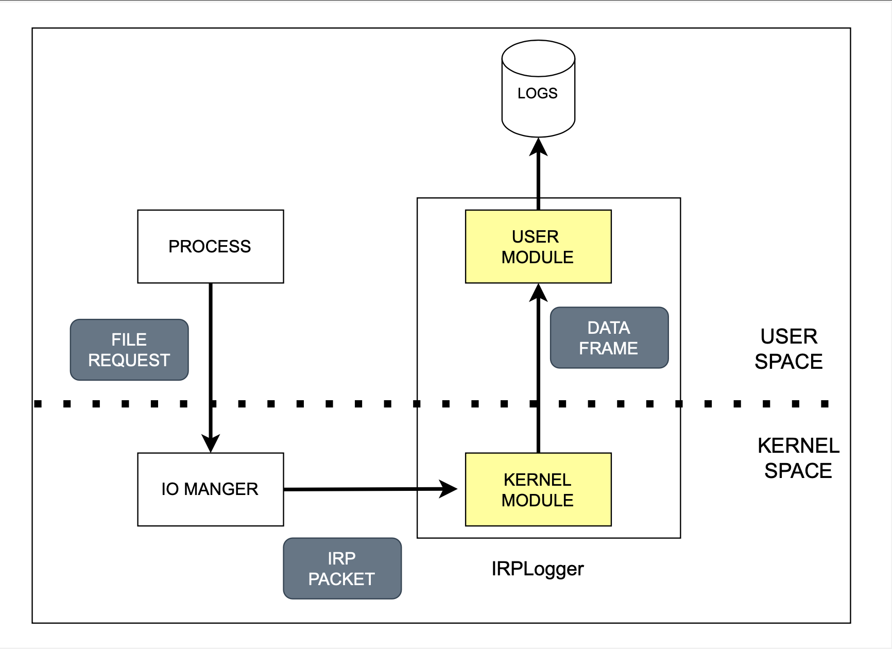

# IRPLogger

The IRPLogger is software that extracts relevant features from file operations. It receives details of these operations, parses them, and saves the information to a log file. This page explains which parts of the IRPLogger must be modified to capture additional features or to alter existing ones.

## IRPLogger structure

The IRPLogger consists of three components: a kernel module, a user module, and a custom data frame. The kernel (filter) module receives I/O operations, parses the contents, and saves them to a custom data frame. The user module then receives this frame and saves it to a file.



The main steps to add a feature are the following:

1. Identify the feature of interest
2. Add a rule in the filter module
3. Modify the custom frame for storing additional information
4. Modify the user module for printing the additional features

To implement the modification it is sufficient to modify only the files related to these operations:

- IRPLogger/filter/IRPLoggerLog.c
- IRPLogger/user/IRPLoggerLog.c
- IRPLogger/inc/IRPLogger.h

## inc/IRPLogger.h

The inc/IRPLogger.h file defines a RECORD_DATA structure, which serves as a custom frame for collecting various parameters. To capture additional data, this structure can be extended with new variables. At runtime, the logger creates a new frame and provides a pointer to it for the filter to populate. For example, the major function code is defined as a UCHAR variable named callback_major_id.

``` c
typedef struct _RECORD_DATA {
    //
    UCHAR callback_major_id;
    //
} RECORD_DATA, *PRECORD_DATA;
```

## filter/IRPLoggerLog.c

The filter/IRPLoggerLog.c use a `record_data` variable of type `RECORD_DATA` to save the parameters. For example, to save the major function code, we can do the following:

```c
record_data->callback_major_id = data->Iopb->MajorFunction;
```

The dereferencing of `data->Iopb->MajorFunction` variable is defined in the the [IRP packet parsing](irppacket_parsing.md) page.

For an incoming packet, the record_data structure can be modified either before or after the operation, depending on the nature of the operation. The functions `log_pre_operation_data` and `log_post_operation_data` access the data before and after the operation, respectively.
 
Inside these two functions we can define specific filter depending on the IRP packet major function code:

``` c
if (record_data->callback_major_id == IRP_MJ_WRITE) {
    // Specific rules for write operation
}
```

If additional information needs to be extracted, we can proceed as follows:

``` c
// 1. Check major function code
if (data->Iopb->MajorFunction == IRP_MJ_SET_INFORMATION)
	{
		// 2. Check FileInformationClass Value
		if (data->Iopb->Parameters.SetFileInformation.FileInformationClass 
        == FileRenameInformation)
		{
            // 3. Get pointer to specific structure
            PFILE_RENAME_INFORMATION renameInfo;
			renameInfo = (PFILE_RENAME_INFORMATION)data->Iopb->Parameters.
            SetFileInformation.InfoBuffer;
            //...

        }
    }
```

The code example perform the following operations:

1. Check the major function code.
2. Verify the subcase using the `FileInformationClass` variable inside the specific struct.
3. Obtain a pointer to the operation specific structure.


## /user/IRPLoggerLog.c

The user/IRPLoggerLog.c uses a `log_on_file` function to parse the  `RECORD_DATA` data frame and save it to a file.

For example, for saving the type of operation we can do the following:

``` c
if (record_data->flags & FLT_CALLBACK_DATA_IRP_OPERATION)
	fprintf(file, "IRP");
```

In case of specific parameters, we can check the major function code:

``` c
 if(record_data->callback_major_id == IRP_MJ_SET_INFORMATION) 
    {
        fprintf(file, "InfoClass: %X\t", record_data->x.FileRename.FileInformationClass);
        // ...
    }
```

The previous example saves the `FileInformationClass` value to file to detonate the subcase.

