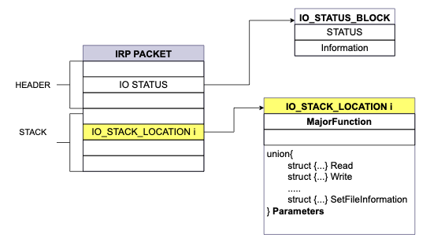
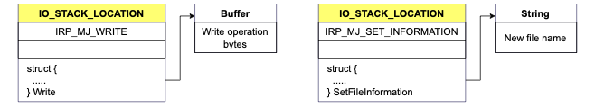
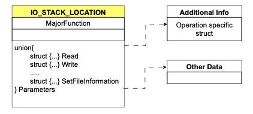
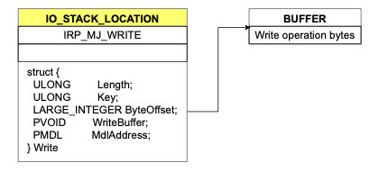
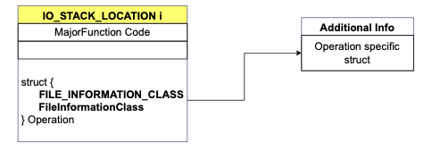
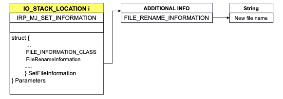

# IRP Packet

<!-- to do add like with makjor functoin codes.  -->
This page provides an overview of how IRP packets are organized. The [IRP packet parsing](./irppacket_parsing.md) pages provides more the details on how to parse the packet for collecting features on file operations.

Microsoft executes **file operation** using a common data structure called [IRP packets](https://learn.microsoft.com/en-us/windows-hardware/drivers/gettingstarted/i-o-request-packets). Processes cannot directly manipulate files, which are executed by the operating system. Behind the curtain, the OS packs all the relevant details in an IRP packet and sends it to device performing the operations. 

   
An IRP packer has two main components: a header and a stack location The **header** contains information for the operating system to send the packet in the proper way inside the system, while the **stack** contains the actual parameters for the operation. In this guide, we focus on the stack location has it contains the value or interest to record the operations.

<figure markdown="span">
    
    <figcaption>IRP packet header and stack</figcaption>
</figure>

The IRP packet is designed to minimize the amount of data to be transported; therefore, it contains several pointers to the appropriate data. For write operations, the packet includes a pointer to the buffer that will overwrite the original contents. For a file rename operations, the packet contains a pointer to the string with the new name.

<figure markdown="span">
    
    <figcaption>Additional data for write operation (on the left) and rename operation (on the right)</figcaption>
</figure>
 

## IRP Packet stack overview

The stack location has **two** main components: the major function code and the parameters. The stack may contains pointers to other structure or data; we provide more details in the next section. 

<figure markdown="span">
    
    <figcaption>IRP packet general structure</figcaption>
</figure>

The [Major function code](https://learn.microsoft.com/en-us/windows-hardware/drivers/ifs/irp-major-function-codes-fs-filters) is a unique identifier for the operation type. For example, for a write operation on a file, the Major function code is `IRP_MJ_WRITE`. The Microsoft documentation contains descriptions of the major function code and the operations they represents. 

The [Parameters](https://learn.microsoft.com/en-us/windows-hardware/drivers/ddi/fltkernel/ns-fltkernel-_flt_parameters) variable contains all the associated information for that specific operation. The `Parameters` variable is a union of different structures. Hence, the structure type changes accordingly to the type of the operation. For example, for a file write operation, the Parameters is a struct Write. Each structure contains the details of the operation. In the file write case, the structure contains the offset from the file start and number of bytes to write. 

<figure markdown="span">
    
    <figcaption>IRP packet for a write operation</figcaption>
</figure>   

So, each major function code has an associated **structure** packing the relevant contents Hence, it is necessary to know for each file operation the major function code / parameter type pair. The following table show some examples:

| **File Operation** | **Major Function code** | **Parameter type**        |
|--------------------|-------------------------|---------------------------|
| File write         | IRP_MJ_WRITE            | struct Write              |
| File read          | IRP_MJ_READ             | struct Read               |
| File rename        | IRP_MJ_SET_INFORMATION  | struct SetFileInformation |

For a write file operation, the IRP packet has a major function code of IRP_MJ_WRITE, and the associated structure is named struct Write. Similarly, for a read file operation, the major function code is IRP_MJ_READ, with the associated structure being struct Read. Some major function codes cover several cases. For example, IRP_MJ_SET_INFORMATION is associated with the modification of file metadata, such as during a file rename operation. The next section provides additional information on these specific cases.

## IRP Packet additional information

As we saw above, the same IRP code may be associated to different type of operations, hence the packet needs to carry additional parameter. The specification is similar to the main IRP packet structure; a label specifies the nature of the parameters, a specialized struct carries them. 

<figure markdown="span">
    
    <figcaption>IRP packet with additional parameters</figcaption>
</figure> 

A `FileInformationClass` identifies the operation; the variable is defined as a `FILE_INFORMATION_CLASS` [enumeration](https://learn.microsoft.com/en-us/windows-hardware/drivers/ddi/wdm/ne-wdm-_file_information_class), listing all the of possibile additional information case. The additional parameters are packed in a specific structure. 

For example, the rename file operation uses this scheme.

- The associated MajorFunction code is IRP_MJ_SET_INFORMATION.
- The struct is the SetFileInformation. 
- The FILE_INFORMATION_CLASS variable has value FileRenameInformation. 
- The additional operations are stored in a struct name FILE_RENAME_OPERATION which contains a pointer to the new file name string.

<figure markdown="span">
    
    <figcaption>IRP packet for a rename  operation</figcaption>
</figure> 

