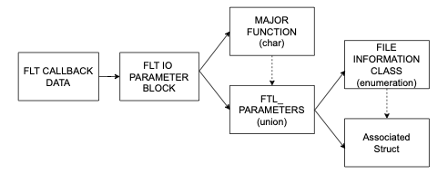

# IRP Packet Parsing

This page provides details on how to extract relevant features for file operations. Consulte the [IRP Packet](irppacket.md) page for a reference on how IRP packets are organized and the [IRPLogger](./irplogger.md) for an overview of the software for collecting the features. 

## Parse IRP Packet 



The IRPLogger receives a `data` frame with a `FLT_CALLBACK_DATA` structure containing several elements. The most important is a pointer `PFLT_IO_PARAMETER_BLOCK Iopb`. The Iopb containts pointers to the IRP major function code and FLT_PARAMETERS.


1. Determine the FileInformationClass value
2. Cast the InfoPointer buffer to the 
3. Use the pointer

The following code, extracted from filter/IRPLoggerLog.c, demonstrates how to parse a packet for delete operations. The primary function code used is IRP_MJ_SET_INFORMATION, with additional parameters stored in the FILE_DISPOSITION_INFORMATION structure. For more details, refer to the [IRP packet](./irppacket.md) page. Consider the following example for the deletion of a file:

```c
	if (data->Iopb->MajorFunction == IRP_MJ_SET_INFORMATION)
	{
		int fileinformationclass;
		fileinformationclass = data->Iopb->Parameters.SetFileInformation.FileInformationClass;
		record_data->x.SetInformation.InfoTag = fileinformationclass;

		if (fileinformationclass == FileDispositionInformation)
		{
			PFILE_DISPOSITION_INFORMATION ptr;
			ptr = (PFILE_DISPOSITION_INFORMATION)data->Iopb->Parameters.SetFileInformation.InfoBuffer;
			record_data->x.SetInformation.InfoClass.Delete = ptr->DeleteFile;
		}
  }
```
The code performs the following operations:


1. Check if the Major code is `IRP_MJ_SET_INFORMATION`
2. Verify if the fileinformationclass for the FileDispositionInformation. 
3. Declare a PFILE_DISPOSITION_INFORMATION pointer to FILE_DISPOSITION_INFORMATION struct
4. Cast the InforBuffer to PFILE_DISPOSITION_INFORMATION 
5. Differentiate the pointer to access elements within the FILE_DISPOSITION_INFORMATION structure.


## List of features

Total list of features use by the different model.

- Entropy              
- Similarity           
- Override ratio       
- Delete               
- File type cross Write
- File type cross R/W  
- File type Coverage   
- File type change     
- File Rename/Move     
- File size change     
- Access Frequency     
- File Create          
- File Read            
- File Write           
- File Close           
- Folder listing       
- Directory Traversal  
- Temporary Files      


Some of them can be directly obtained by the logger. Other instead can be derived with some pre-processing operations.

NB: select WHERE to capture the variation, in the log_pre_operation_data or the log_post_operation_data

## Entropy              

Models: Cryptolock  Unveil  ShieldFS  Redemption  RWGuard 

To compute Entropy use the shannon's formula on the Buffer of the operation.

## File Read            

Models: ShieldFS |  RWGuard

> The read operation has the Major code IRP_MJ_READ

## File Write           

Models: ShieldFS |  RWGuard

> The write operation has the Major code IRP_MJ_WRITE

## File Close           

Models: RWGuard

> The close operation has the Major code IRP_MJ_CLOSE

Note: this code does not have a parameter field

## Access Frequency     

Models: Redemption

> Access frequency is the inverse of elapsed time between two write operation.

Computes the elapsed time between **two** subsequent **write** requests generated by a **single process** to access **two** different files. 

`Access frequency = 1/elapsed time`

As the elapsed time between two write requests increases, the access frequency decreases.

By process, monitor each IRP_MJ_WRITE file name. If the file name is different take the elapsed time from the timestamps and do the difference to get the elapsed time.

## File type cross Write

Models: Redemption

> Check if the process requests **write** access to files that belong to different document classes.

Use the `IRP_MJ_WRITE` to get file operations and get the file extension from the file name.

Q: what is a document class?
Q: can i extract the document class from the file path?

## File type cross R/W  (File type funneling )

Models: Cryptolock

> Check if the number of file types in input is higher than the number of file types in output

File in input:  `IRP_MJ_READ` and filename to extract the extension from the string
File in output: `IRP_MJ_WRITE` and filename to extract the extension from the string


## File type Coverage   

Models: ShieldFS

> Check the percentage of accessed files by file extension

Ordinary processes only access a small number of files by type, ransomwares try to access all of them.

Q: What does it mean **accessed**? Is it a READ, a WRITE or BOTH?

## File Create

Models: RWGuard

Check the `IRP_MJ_CREATE` major code

<!-- ### Expanded version

IRPLogger must be expanded to consider the following features

- Delete               
- File size change     
- Similarity            -->

## Delete               

Models: Cryptolock Redemption

> Relevant codes are IRP_MJ_CREATE and IRP_MJ_SET_INFORMATION


  FileDispositionInformationEx = 64,


Monitor if the process deletes a file

[reference](https://stackoverflow.com/questions/50870373/what-is-the-irp-message-generated-on-file-delete-in-a-filter-driver)


**IRP_MJ_CREATE**

For the Major code `IRP_MJ_CREATE` check the flag FILE_DELETE_ON_CLOSE

data->Iopb->MajorFunction  ==  IRP_MJ_CREATE
data->Iopb->Parameters.Create.Options == FILE_DELETE_ON_CLOSE


**IRP_MJ_SET_INFORMATION**

For the Major code `IRP_MJ_SET_INFORMATION` check if the PFILE_DISPOSITION_INFORMATION flag is of type DeleteFile

data->Iopb->MajorFunction  == IRP_MJ_SET_INFORMATION
data->Iopb->Parameters.SetFileInformation.FileInformationClass == FILE_DISPOSITION_INFORMATION

FILE_DISPOSITION_INFORMATION.DeleteFile == True

PROBLEMA: i file iniziano ad avere componenti diverse

## File size change     

Models: RWGuard

Q1: how do you find the old file size? With a CREATE ? Or With a READ
Q2: How do you find the new file siez? Witha WRITE ?


https://learn.microsoft.com/en-us/windows-hardware/drivers/ddi/wdm/ns-wdm-_file_standard_information
https://learn.microsoft.com/en-us/windows-hardware/drivers/ddi/wdm/nf-wdm-zwqueryinformationfile

```c
#include <ntddk.h>

NTSTATUS GetFileSize(PFILE_OBJECT FileObject, PLARGE_INTEGER FileSize)
{
    NTSTATUS status;
    IO_STATUS_BLOCK ioStatusBlock;
    FILE_STANDARD_INFORMATION fileInfo;

    if (FileObject == NULL || FileSize == NULL) {
        return STATUS_INVALID_PARAMETER;
    }

    status = ZwQueryInformationFile(
        FileObject,
        &ioStatusBlock,
        &fileInfo,
        sizeof(FILE_STANDARD_INFORMATION),
        FileStandardInformation
    );

    if (NT_SUCCESS(status)) {
        *FileSize = fileInfo.EndOfFile;
    }

    return status;
}

void ExampleUsage(PDEVICE_OBJECT DeviceObject, PIRP Irp)
{
    PIO_STACK_LOCATION irpSp;
    PFILE_OBJECT fileObject;
    LARGE_INTEGER fileSize;
    NTSTATUS status;

    irpSp = IoGetCurrentIrpStackLocation(Irp);
    fileObject = irpSp->FileObject;

    if (fileObject) {
        status = GetFileSize(fileObject, &fileSize);
        if (NT_SUCCESS(status)) {
            DbgPrint("File size: %lld bytes\n", fileSize.QuadPart);
        } else {
            DbgPrint("Failed to get file size: %08x\n", status);
        }
    }

    // Continue processing the IRP...
}

```


## Similarity 

Models: Cryptolock Redemption

> sdhash

For the time being in stand-by

<!-- ### To Check

- File type change     
- File Rename/Move     
- Override ratio       
- Folder listing       
- Directory Traversal  
- Temporary Files       -->

## File type change / File name change / File move 

**NB** for all of this we just simply observe change in the file path.

Models: Cryptolock RWGuard

- Cryptolock: just monitor the file type change
- RW_GUARD:  Ransomwares change the file type **after** encryption. Monitor the file type change before and after a write operation

> IRP packet: IRP_MJ_SET_INFORMATION 

Place the capture in the `log_post_operation_data` function in the filter space. 

File rename is communicated with a `IRP_MJ_SET_INFORMATION` packet. The FLT_PARAMETERS struct associated with this IRP is is the `SetFileInformation`. This contains a `FILE_INFORMATION_CLASS FileInformationClass` enumeration with value `FileRenameInformation`. The actual values of the IRP can be accessed using the `PVOID InfoBuffer`. 

The parameter of the IRP are defined in a [`FILE_RENAME_INFORMATION struct`](https://learn.microsoft.com/en-us/windows-hardware/drivers/ddi/ntifs/ns-ntifs-_file_rename_information). The value of interest are the

  - ULONG FileNameLength;
  - WCHAR FileName[1];
    - 
**NB**: FILE_INFORMATION_CLASS is an enumeration specifying which values are accessible through the PVOID InfoBuffer. In the pre and post function we do **not** access a FILE_RENAME_INFORMATION struct directly.  

To store the value we use a struct 
```c 
struct {
ULONG FileNameLength;
WCHAR NewName[64];
} Filename
```
Q: the docs says FileName[1] is the first character in memory so it should be of type WCHAR. How can I cast into a pointer?

Todo: add memory consideration
Todo: add allineation consideration

In the filter space we copy the buffer with the [wcscpy](https://learn.microsoft.com/it-it/cpp/c-runtime-library/reference/strcpy-s-wcscpy-s-mbscpy-s?view=msvc-170), analogus to the strcpy function. 

Likewise, to **print** the path on log file we use the [fwprintf](https://learn.microsoft.com/it-it/cpp/c-runtime-library/reference/fprintf-fprintf-l-fwprintf-fwprintf-l?view=msvc-170) function. Note that the format parameter must be of type WCHAR with parameter `%ls`. Simply use `L"%ls"` as parameter.


**Example:**

Note: The simrep project contains some examples of the InfoBuffer

```c
PFILE_RENAME_INFORMATION renameInfo
renameInfo = Cbd->Iopb->Parameters.SetFileInformation.InfoBuffer
            setInfo.RootDirectory = renameInfo->RootDirectory;
            setInfo.FileNameLength = renameInfo->FileNameLength;
            setInfo.FileName = renameInfo->FileName;

```

**Educated guess**

Note that the Window documentation page of IRP_MJ_SET_INFORMATION packets is inside the legacy filter technology while in this work we are using the Minifilter technology. The FileInformationClass for the legacy it is accessible through a pointer to the IRP, while for the Minifilter we use the InfoBuffer pointer.

The documentation for the minifilter does not specifies the contents of InfoBuffer, it just states that "it Pointer to an input buffer that contains the file information to be set". Given the available exemples, we assume that the contents of the buffer are specified by the `FileInformationClass` associated with the operation.


## Override ratio

Models: Redemption

Verify which percentage of the file is overwritten.

- sA file size 
- yA is the total size of the data blocks modified by the process

Override ratio is calculated as yA/ sA 

| where the higher the number of data blocks modified by the process, the closer the value is to 1.
| even if file is overwritten with the same content it counts as a overwrite. This feature does not consider the contents like similarity.


Q: how many write operations

## Folder listing       

[Description](https://learn.microsoft.com/en-us/windows-hardware/drivers/ifs/irp-mj-directory-control)

Models ShieldFS

> Major IRP_MJ_DIRECTORY_CONTROL Minor IRP_MN_QUERY_DIRECTORY

Number of folder-listing operations normalized by the total number of folders in the system.

The actual request depends on a FileInformation filed
ToDO: cl


| FileInformationClass           | Description                                                     |
|--------------------------------|-----------------------------------------------------------------|
| FileBothDirectoryInformation   | FILE_BOTH_DIR_INFORMATION struct for each file.                 |
| FileDirectoryInformation       | FILE_DIRECTORY_INFORMATION struct for each file.                |
| FileFullDirectoryInformation   | FILE_FULL_DIR_INFORMATION struct for each file.                 |
| FileIdBothDirectoryInformation | FILE_ID_BOTH_DIR_INFORMATION struct for each file.              |
| FileIdFullDirectoryInformation | FILE_ID_FULL_DIR_INFORMATION struct for each file.              |
| FileNamesInformation           | FILE_NAMES_INFORMATION struct for each file.                    |
| FileObjectIdInformation        | FILE_OBJECTID_INFORMATION struct for each file.                 |
| FileReparsePointInformation    | single FILE_REPARSE_POINT_INFORMATION struct for the directory. |


## Directory Traversal  

Models Redemption

Redemption monitors if the process traverses over the user files with write privilege, and computes the additive inverse of the number of privileged accesses to unique files in a given path. 

## Temporary Files      

Models RWGuard

